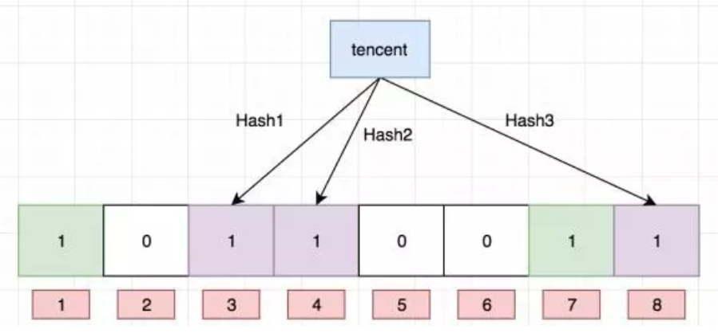

# 01.redis雪崩&穿透&击穿

## 1.1 缓存穿透

`查询一个不存在的key`

- 1）定义
  - 缓存穿透是指查询一个一定不存在的数据，由于缓存不命中，接着查询数据库也无法查询出结果
  - 虽然也不会写入到缓存中，但是这将会导致每个查询都会去请求数据库，造成缓存穿透；

- 2）解决方法 ：布隆过滤
  - 对所有可能查询的参数以hash形式存储，在控制层先进行校验，不符合则丢弃，从而避免了对底层存储系统的查询压力；

## 1.2 缓存击穿

`热点key突然失效,导致直接查询mysql`

- 1）定义：
  - 1.缓存击穿，就是说某个 key 非常热点，访问非常频繁，处于集中式高并发访问的情况
  - **2. 当这个 key 在失效的瞬间，大量的请求就击穿了缓存，直接请求数据库，就像是在一道屏障上凿开了一个洞。**

- 2）解决方法
  - 1.解决方式也很简单，可以将热点数据设置为永远不过期；
  - 2.或者基于 redis or zookeeper 实现互斥锁，等待第一个请求构建完缓存之后，再释放锁，进而其它请求才能通过该 key 访问数据。

## 1.3 缓存雪崩

`缓存层全部失效`

- **1）定义**
  - 缓存雪崩是指，由于缓存层承载着大量请求，有效的保护了存储层，但是如果缓存层由于某些原因整体不能提供服务
  - 于是所有的请求都会达到存储层，存储层的调用量会暴增，造成存储层也会挂掉的情况。

- **2）解决方法**
  - **保证缓存层服务高可用性：**比如 Redis Sentinel 和 Redis Cluster 都实现了高可用
  - **依赖隔离组件为后端限流并降级：**比如对某个key只允许一个线程查询数据和写缓存，其他线程等待。

# 02.布隆过滤器

## 2.1 布隆过滤器是什么？

`判断某个key一定不存在`

- 1.本质上布隆过滤器是一种数据结构，比较巧妙的概率型数据结构

- 2.特点是高效地插入和查询，可以用来告诉你 “某样东西一定不存在或者可能存在”。

- 3.相比于传统的 List、Set、Map 等数据结构，它更高效、占用空间更少，但是缺点是其返回的结果是概率性的，而不是确切的。

- **使用：**
  - 1.布隆过滤器在NoSQL数据库领域中应用的非常广泛
  - 2.当用户来查询某一个row时，可以先通过内存中的布隆过滤器过滤掉大量不存在的row请求，然后去再磁盘进行查询
  - 3.布隆过滤器说某个值不存在时，那肯定就是不存在，可以显著降低数据库IO请求数量

## 2.2 应用场景

- 1）场景1（给用户推荐新闻）
  - 1.当用户看过的新闻，肯定会被过滤掉，对于没有看多的新闻，可能会过滤极少的一部分（误判）。
  - 2.这样可以完全保证推送给用户的新闻都是无重复的。

- **2）场景2（爬虫url去重）**
  - 1.在爬虫系统中，我们需要对url去重，已经爬取的页面不再爬取
  - 2.当url高达几千万时，如果一个集合去装下这些URL地址非常浪费空间

  - 3.使用布隆过滤器可以大幅降低去重存储消耗，只不过也会使爬虫系统错过少量页面

## 2.3 布隆过滤器原理

- 1.每个布隆过滤器对应到Redis的数据结构是一个大型的数组和几个不一样的无偏hash函数

- 2.如下图：f、g、h就是这样的hash函数（无偏差指让hash映射到数组的位置比较随机）

- **添加：**值到布隆过滤器
  - 1）向布隆过滤器添加key,会使用 f、g、h hash函数对key算出一个整数索引，然后对长度取余
  - 2）每个hash函数都会算出一个不同的位置，把算出的位置都设置成1就完成了布隆过滤器添加过程

- **查询：**布隆过滤器值
  - 1）当查询某个key时，先用hash函数算出一个整数索引，然后对长度取余
  - 2）当你有一个不为1时肯定不存在这个key，当全部都为1时可能有这个key
  - 3）这样内存中的布隆过滤器过滤掉大量不存在的row请求，然后去再磁盘进行查询，减少IO操作
- **删除：不支持**
  - 1）目前我们知道布隆过滤器可以支持 add 和 isExist 操作
  - 2）如何解决这个问题，答案是计数删除，但是计数删除需要存储一个数值，而不是原先的 bit 位，会增大占用的内存大小。
  - 3）增加一个值就是将对应索引槽上存储的值加一，删除则是减一，判断是否存在则是看值是否大于0。

 </img>

