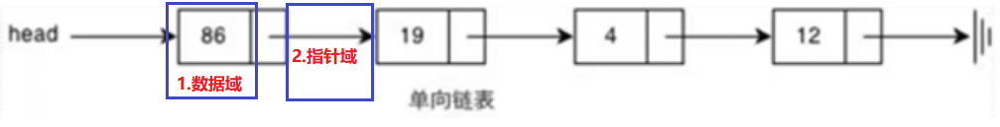

# 01.链表

https://www.cnblogs.com/xiaonq/p/8574655.html#i4

## 1.1 单链表定义

- 注：链表中每个元素都是一个对象，每个对象称为一个节点
- 每个节点包含两部分：
     - `数据域`： 存放当前节点数据
     - `指针域`： 指向下一个节点的内存地址

 </img>

## 1.2 python模拟单链表

```python
class Node(object):
    def __init__(self, item,next=None):
        self.item = item
        self.next = next
        
l = Node(1,Node(2,Node(3,Node(4))))
print(l.item)
print(l.next.item)
```

## 1.3 单向链表反转

```python
#! /usr/bin/env python
# -*- coding: utf-8 -*-
class Node(object):
    def __init__(self, val):
        self.val = val
        self.next = None

def list_reverse(head):
    if head == None:
        return None
    L, R, cur = None, None, head  # 左指针、有指针、游标
    while cur.next != None:
        L = R             # 左侧指针指向以前右侧指针位置
        R = cur           # 右侧指针前进一位指向当前游标位置
        cur = cur.next    # 游标每次向前进一位
        R.next = L        # 右侧指针指向左侧实现反转
    cur.next = R          # 当跳出 while 循环时 cur(原链表最后一个元素) R(原链表倒数第二个元素)
    return cur

if __name__ == '__main__':
    '''
    原始链表：1 -> 2 -> 3 -> 4
    反转链表：4 -> 3 -> 2 -> 1
    '''
    l1 = Node(1)
    l1.next = Node(2)
    l1.next.next = Node(3)
    l1.next.next.next = Node(4)
    l = list_reverse(l1)
    print l.val         # 4  反转后链表第一个值4
    print l.next.val    # 3  第二个值3
```

## 1.4 链表时间复杂度

- 从链表中取出一个元素，时间复杂度： `O(n)`    
     - n代表列表长度
- 遍历链表： `O(N)`

- 删除一个链表中的元素：O(1)

