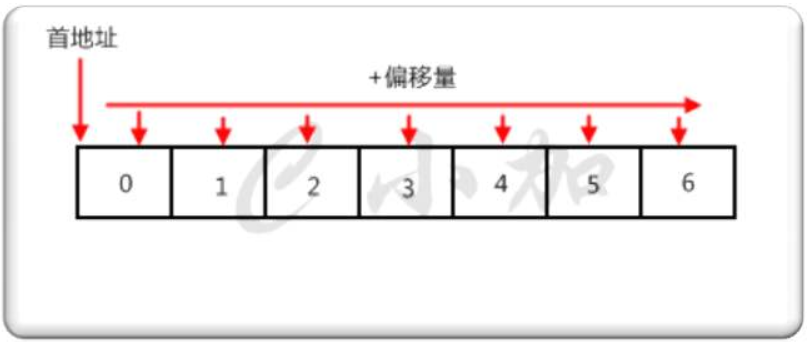
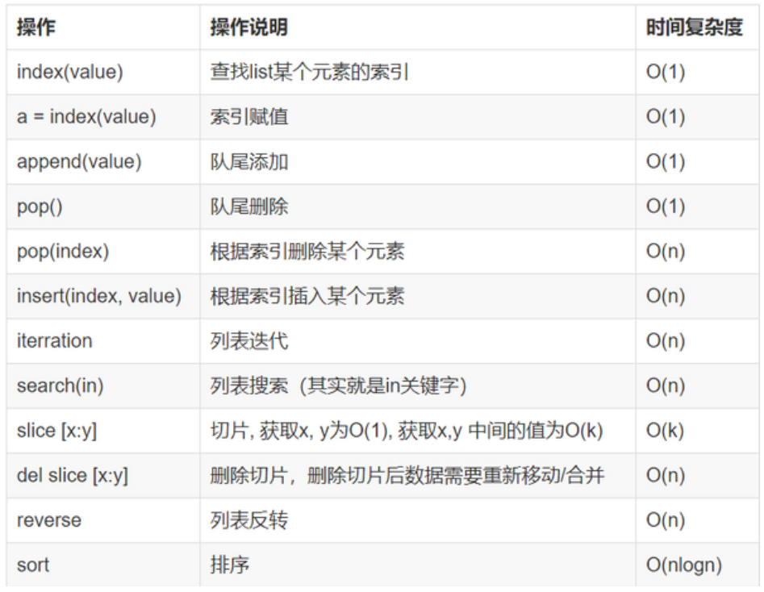

# 01.数组

## 1.1 数组定义

- 1.所谓数组，就是`相同数据类型的元素按一定顺序排列的集合`
- 2.`在Java等其他语言中`并不是所有的数据都能存储到数组中，`只有相同类型的数据才可以一起存储到数组中`。
- 3.因为数组在`存储数据时是按顺序存储的`，`存储数据的内存也是连续的`，所以他的特点就是寻址读取数据比较容易，插入和删除比较困难。

 </img>

## 1.2 python中list与数组比较

- 1.python中的list是python的内置数据类型，`list中的数据类不必相同的，而数组（array）的中的类型必须全部相同`。
- 2.在list中的数据类型保存的是数据的`存放的地址，简单的说就是指针，并非数据`
- 3.否则这样保存一个list就太麻烦了，例如list1=[1,2,3,'a']需要4个指针和四个数据，增加了存储和消耗cpu。

 </img>