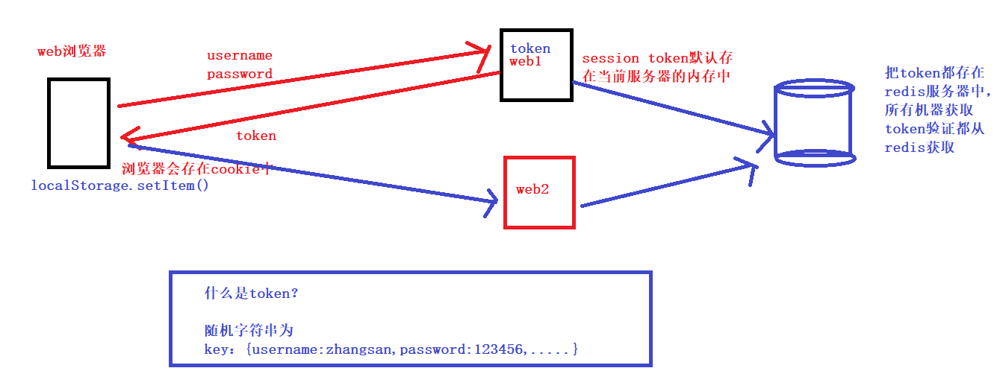

# 01.redis实现单点登录

> 使用Redis实现分布式部署单点登录（单点登录第一种方法：redis分布式存储解决方案）

因为这个项目是一个分布式部署的项目，而且我们采用的是nginx负载均衡的策略，导致了每一个服务器都需要开辟一个空间来进行用户信息的维护，消耗了大量的资源，所以，我当时使用到了Redis来作为维护用户信息的空间，将用户登录的信息存入Redis中，并且在存入时设置key的过期时间，所有的服务器共用一个Redis，每次进行操作时只需要去Redis中去判断这个用户是否存在，存在的话就说明这个用户现在是登录状态，不存在就说明这个用户没有登录，或者登录已经失效，让用户进行重新登录。

- 为什么会存在单点登录的问题
     - **session默认是存储在当前服务器的内存中**，如果是集群，那么只有登录那台机器的内存中才有这个session
     - 比如说我在A机器登录，B机器是没有这个session存在的，所以需要重新验证
- 如何解决这个单点登录问题
     - 不管在那一台web服务器登录，都会把token值存放到我们的一个集中管理的redis服务器中
     - 但客户端携带token验证的时候，会先从redis中获取，就实现单点登录
- 现实举例
     - 比如你写的一个tornado项目，分别部署到A，B两台机器上
     - 如果直接使用session，那么如果在A机器登录，token只会在A服务器的内存
     - 因为请求会封不到A，b连个机器，如果这个请求到了B机器，B的内存中没有就会让重新登录
     - 所以登录A机器的时候我们应该把token值写入到redis中，A/B机器登录，都从redis中获取token进行校验

