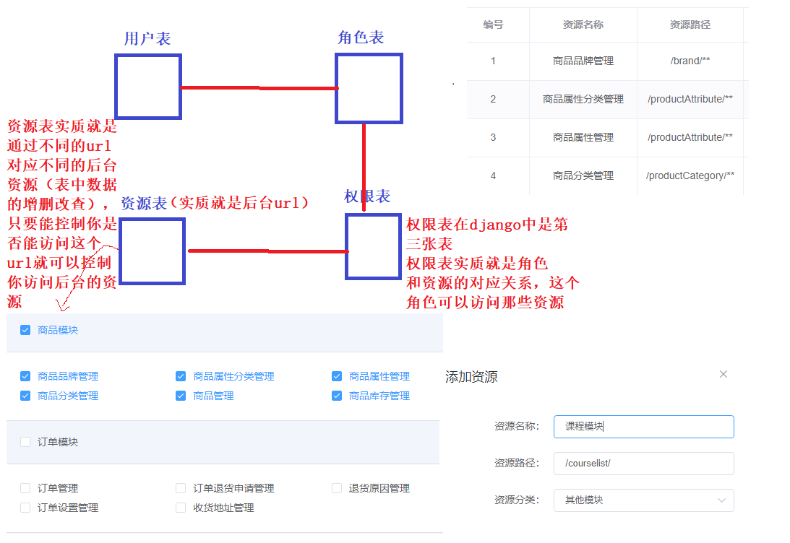

# 01.RBAC角色权限管理机制

> 基于 Django 的后台管理平台，采用 RBAC 权限管理机制

- 用户表、角色表、权限表
     - 用户表：账号、姓名、邮箱、添加时间、最后登录时间、账号是否禁止登录
     - 角色表：商品管理员、订单管理员、超级管理员
     - 资源列表：资源名称（项目模块名称），资源路径（后台路由）
     - 资源分类：商品模块、订单模块、营销模块、权限模块、内容模块、其他模块
     -  </img>

#### RBAC角色权限管理机制实现思路

```python
# 面向资源编程
https://www.shiyanlou.com/v1/books/        # 请求后端 books书籍表中数据
	get
    post
# 用户表
# 角色表
# 权限表
get/post/put/delete 对应关系
```

- 所有权限的本质是对数据库中表中数据增删改查的操作
- 而这些增删改查的操作是通过前端不同路由，通过get、post、put、delete方法操作数据库的
- 对权限的控制，最简单的方法就是判断当前用户是否可以对指定路由请求操作的权限
- 把角色和这个角色能够访问的 url 和 请求方式进行关联（因为正是的业务逻辑用户权限划分力度可能非常细致）
- 再简单的业务逻辑中这一张表就是权限表

| 路由 资源(可能对应的是后端路由的 name名称，可以通过name名称解析出对应路由) | 请求方式 | 说明                              |
| ------------------------------------------------------------ | -------- | --------------------------------- |
| https://www.shiyanlou.com/v1/books/                          | get      | 判断用户是否可以查询books表中数据 |
| https://www.shiyanlou.com/v1/books/                          | post     | 判断用户是否可以添加books表中数据 |
| https://www.shiyanlou.com/v1/books/                          | put      | 判断用户是否可以更新books表中数据 |
| https://www.shiyanlou.com/v1/books/                          | delete   | 判断用户是否可以删除books表中数据 |

- 后端如何判断用户权限
     - 用户发送求方法 https://www.shiyanlou.com/v1/books/ 的url
     - 后端首先查询时哪一个用户，然后查询当前用户的角色
     - 最后判断这个角色是否可以访问 https://www.shiyanlou.com/v1/books/ 的对应方法即可
     - 如果这个角色有权限访问这个url就返回数据，不能访问就返回 401状态码