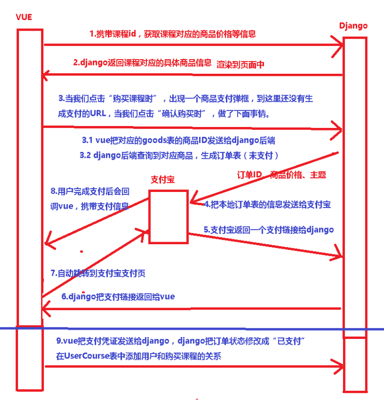

# 08.三方支付

> 集成支付宝、微信、银联等进行聚合支付(怎么保证接口安全)

支付宝支付：https://www.cnblogs.com/xiaonq/p/12332990.html

- 相关的资源：appid、支付宝公钥、app公钥、app私钥、django环境

- 流程

     - 生成公钥（app公钥、app私钥）
     - APP的公钥要上传到沙箱环境，然后我们要下载支付宝公钥

- 代码如何实现

     - 第一：生成支付的url
          - 在电脑本地生成公钥、私钥（app公钥、app私钥）
          - APP的公钥要上传到沙箱环境，然后我们要下载支付宝公钥
          - 提供（实例化Alipay对象）：appid、支付宝公钥、app私钥
          - 提供（拼接付款的url）：订单id、金额、标题、return_url(付款成功的回调接口)、notify_url(付款成功后的异步通知)
     - 第二：主动查询支付结果
          - 提供（实例化Alipay对象）：appid、支付宝公钥、app私钥
          - 提供一个 订单id就可以查询当前订单支付结果

 </img>

- 支付宝是如何保证数据安全的（数据传输如何保证安全）

     