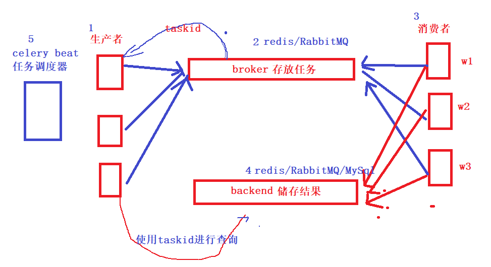

# 01.celery异步任务定时任务

> 课程加入路径celery触发更新提醒

- celery原理

     

- celery应用场景

     - 异步任务
          - 发邮件、发送消息
          - 自动化工单中耗时任务
          - 所有需要异步处理的请求都可以
     - 定时任务
          - 工单系统定时获取超时工单进行延时报警
          - 对过期会员进行清理

- celery的场景（生产者消费者）可以使用多线程解决吗

     - 前端发送一个请求，执行自动化工单需要半个小时，这时候如果使用多线程页面会等待吗？