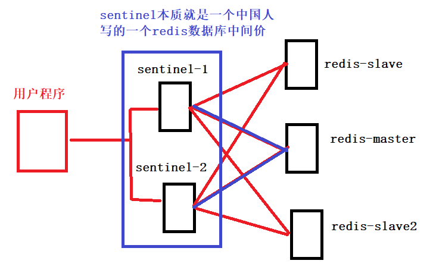
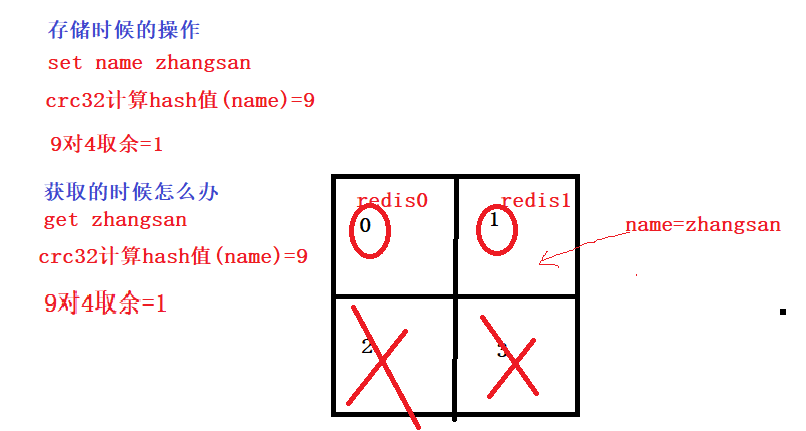

# 01.基于Redis搭建高可用集群

> 实现可靠缓存服务即热点数据保存。redis持久化，集群，哨兵，主从，缓存击穿，热点key。

- redis有哪几种集群
     - 主从模式
     - 哨兵模式
     - codis
- redis主动同步机制
     - **RDB**
          - 全量同步：从服务器把有的数据全部丢弃，让主服务把所有数据全部发给他
     - **AOF**
          - 增量同步：主服务器只发送从服务器缺少的数据
     - **redis主从同步应该采用哪种方式**
          - 主从刚刚连接的时候，进行全量同步；全同步结束后，进行增量同步。
          - 当然，如果有需要，slave 在任何时候都可以发起全量同步。
          - redis 策略是，无论如何，首先会尝试进行增量同步，如不成功，要求从机进行全量同步。
- redis主从
     - 写主库、读从库，减轻服务器读压力
     - 缺点：但是redis主从不能自动切换master，所以master如果挂掉了，整个集群都不可以写入啦

- 哨兵模式如何解决主从问题

     - 当用Redis做主从方案时，假如master宕机，Redis本身无法自动进行主备切换
     - 而Redis-sentinel本身也是一个独立运行的进程，它能监控多个master-slave集群，发现master宕机后能进行自动切换。

- **sentinel原理**

     - sentinel负责持续监控主节点的健康，当主节挂掉时，自动选择一个最优的从节点切换成主节点
     - 从节点来连接集群时会首先连接sentinel，通过sentinel来查询主节点的地址
     - 当主节点发生故障时，sentinel会将最新的主节点地址告诉客户端，可以实现无需重启自动切换redis

     

     - sentinel缺点
          - redis的slave和master数据时完全一样的，但是有个问题，redis数据时存储在内存中
          - 内存空间有限，所以哨兵模式不能处理大的数据量

- codis

     - **为什么会出现codis**
          - 在大数据高并发场景下，单个redis实例往往会无法应对
          - 首先redis内存不易过大，内存太大会导致rdb文件过大，导致主从同步时间过长
          - 其次在CPU利用率中上，单个redis实例只能利用单核，数据量太大，压力就会特别

     - **codis部署方案**
          - 单个codis代理支撑的QPS比较有限，通过启动多个codis代理可以显著增加整体QPS
          - 多codis还能起到容灾功能，挂掉一个codis代理还有很多codis代理可以继续服务

 </img>

- **codis分片的原理**
     - codis负责将特定key转发到特定redis实例，codis默认将所有key划分为1024个槽位
     - 首先会对客户端传来的key进行crc32计算hash值，然后将hash后的整数值对1024进行取模，这个余数就是对应的key槽
     - 每个槽位都会唯一映射到后面的多个redis实例之一，codis会在内存中维护槽位和redis实例的映射关系
     - 这样有了上面key对应的槽位，那么它应该转发到那个redis实例就很明确了
     - 槽位数量默认是1024，如果集群中节点较多，建议将这个数值大一些，比如2048,4096

