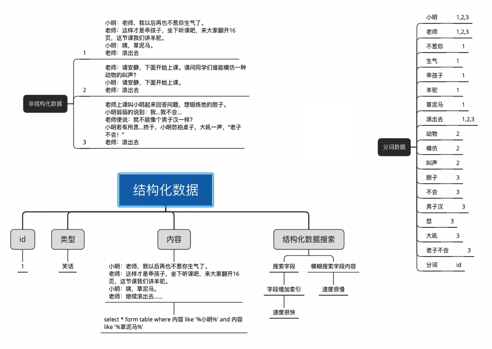
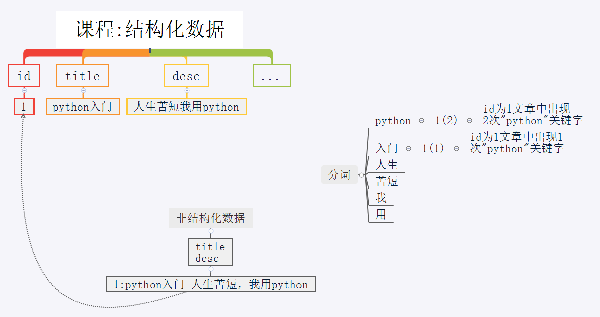

# 11.使用Elasticsearch全文检索

## 1.1 倒排索引

- `搜索引擎中存储的是倒排索引，就是分好的词，和词语文章的关联`

- 事先把文章使用分词打散，以词为依据，标记清楚对应的文章的编号

- 查询时
     - 把查询的语句也进行分词，然后根据分词，找到那些文章中包含了这些词

 </img>

## 1.2 django创建全文索引的过程

- 1.django中提供的是结构化数据（mysql中）
- 2.haystack（搜索框架）把结构化转非结构化
- 3.搜索引擎（ES，whoosh）把非结构化转分词

 </img>