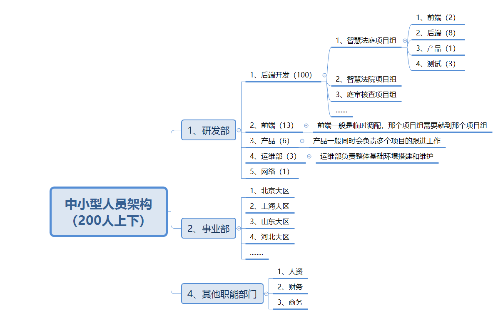

# 01.互联网公司组织架构

## 1.1 互联网公司人员介绍

### 1.1.1 中大型公司人架构（1000人上下）

 </img>

### 1.1.2 中小型公司人员架构（200人上下）

 </img>

## 1.2 公司开发环境介绍

- 开发环境
     - 本地电脑
     - 开发机器：
          - 给开发人员自己用的测试机器
          - 比较大的公司才会有（公司给每一个开发人员可能都会配置一个单独的机器作为开发机器，这个机器是线上的）
- 测试环境
     - 代码开发完毕后，把dev分支上新的代码部署到测试环境
     - 有专业的测试人员进行测试
- 沙箱环境/灰度环境
     - 代码全量上线前，在某一台机器中部署新的代码，观察上线后监控反馈的结果
     - 如果没有问题，在所有线上机器全量同步
     - 如果有报警，证明代码有问题，自动回到某一个稳定版本
- 线上环境
     - 在线上机群众部署的项目，直接给用户用的

- `注：200人一下的公司大多数都是使用云服务器`

# 02.项目人员组成

- 中小型项目一般研发组不会超过20人
     - 后端的数量一般是前端数量的三倍比较合适（比如：前端2人，后端6人，测试2人）
     - 一个产品人员正常会同时负责几个项目的跟进工作
     - 运维和网络是公共资源，所有项目组共同使用
- 项目中角色
     -  1）大前端（前端、安卓、IOS）
     -  2）后端（python、Java、Php、Go）
     -  3）产品
     -  4）运维和网络
- `普通app项目：建议说法`（项目不要说得太大，小项目即可）
     - Python后端 2 人
     - 大前端
          -  前端：1人
          -  安卓：1人
          -  IOS：1人
          -  注：大前端不一定都是这样，也可以是混合开发
     - 测试：1人（没有或者开发自己测试）
     - 产品：产品1人（小型项目很多时候产品负责多个项目，特别是100人一下公司，可能公司只有1到2个产品）
- `中型app项目：建议说法`（不建议大家把项目写的过大）
     - python后端：6人
     - 大前端
          -  前端：2人
          -  安卓：2人
          -  IOS：2人

          -  注：大前端不一定都是这样，也可以是混合开发

     - 测试：3人

