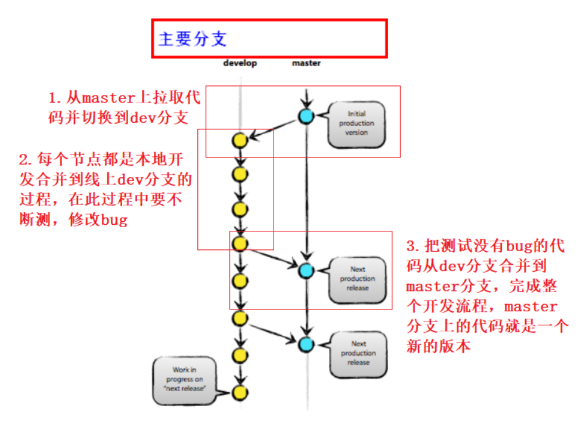

# 1.git分支说明

- 1.master 主分支，稳定代码，为生产环境做准备的
- 2.develop 开发分支，为开发服务（测试没有问题的代码最终会合并到master分支形成文档版本）

- 3.git的三个工作区域
     -  1）**工作区：** 就是你在电脑上看到的目录，比如目录下testgit里的文件(.git隐藏目录版本库除外)。
     -  2）**暂存区 :** 暂存区就是文件夹 .git中的一个小部分（.git文件夹就是版本库）
     -  3）**版本库:** 工作区有一个隐藏目录.git,这个不属于工作区，这是版本库， 版本库中还有Git为我们

 </img>

# 2.真实环境开发流程

## 2.1自己创建django项目推送到仓库

```python
django-admin startproject demo2
cd demo2                          # 切换到项目路径
git init                          # 初始化这个本地git仓库
# git remote rm origin            # 如有路径不一致可以先删除现有的路径       
git remote add origin http://192.168.56.12/devopsedu/demo2.git    #设置代码提交url路径
touch Readme                      # 新建一个项目文件（工作区）
git add .                         # 把工作区中所有变更全部提交到（暂存区）
git commit -m 'init'              # 把暂存区代码提交到本地git仓库，只有提交到代码库才能被git管理（本地git仓库）
git push origin master            # 将本地仓库的代码推送到线上仓库（线上git仓库）
```

```python
# 代码回滚
git log                        #查看所有提交到仓库的版本记录:   git log -2
git reflog                     #查看所有操作记录（状态的md5值和改变的值）
git reset --hard d9e0ed0       #回到指定版本（d9e0ed0是创建版本的MD5值得前6位或者7位）
git reset --hard HEAD^         #回到上一个版本
注：这样可以回到第一次提交到仓库的状态，但再使用git log看不到其他几次的md5值了
```

## 2.2 在本地创建一个dev分支，开发完成后合并到master分支

```python
'''1. 从master分支切换到dev分支进行开发并推送到dev分支的过程'''
git checkout -b dev master    # 从master分支创建dev开发分支
git branch                    # 可以看到现在已经切换到dev分支了
vim Readme                    # 模拟在项目中修改代码
git add .                     # 把工作区中所有变更全部提交到（暂存区）
git commit -m 'in dev'        # 把暂存区代码提交到本地git仓库（本地git仓库）
git push origin dev           # 把代码先推倒dev分支，让测试人员测试

'''2. 当测试人员测试完成后将dev分支代码合并到master形成文档版本'''
git checkout master           # 开发完成后，需要合并回master分支，先切换到master分支
cat Readme                    # 可以看到master分支的内容没有修改
git merge --no-ff dev         # 将刚刚dev中修改的代码合并到master
git push origin master        # 将本地仓库的代码推送到线上仓库（线上git仓库）
```

## 1.只有master分支情况下（一个人负责维护项目）

```python
git clone git@gitee.com:xiaonqedu/daily1904.git
vim test.txt                 # 工作区(本地的仓库)
git add .                    # 当前修改是在暂存区（本地仓库）
git commit -m '0514'         # 把暂存区的代码永久保存到 版本库中，这样代码就不会丢失（本地版本仓库）
git log -2                   # 查看最近两次的版本号，以便回归
# 回滚
git reset --hard 41e1efb     # 回滚到任意版本
git reflog                     #查看所有操作记录（状态的md5值和改变的值）
# 把本地真正开发的代码提交到线上代码仓库
git push origin master              # 此时代码才会更新到线上的代码仓库
```

## 2.多人协同开发，一般有master分支和dev分支

  　　1. master 主分支，稳定代码，为生产环境做准备的
        　　2. develop 开发分支，为开发服务（测试没有问题的代码最终会合并到master分支形成文档版本）

```python
git clone git@gitee.com:xiaonqedu/daily1904.git
git branch                                  # 查看当前所在分支
git checkout -b dev master                  # 从master分支切换到了dev分支
vim test.txt                               # 模拟开发过程
git add .
git commit -m 'dev0514'                    # 把代码提交到了本地dev分支上

# 切换到master分支
git checkout master

# dev分支是一个开发分支，如果测试发现没有问题，需要把dev分支代码合并到master分支，形成最终稳定版本
git merge dev                              # 把dev分支中的代码合并到master中
git push origin master                     # 把本地仓库中master代码推送到线上
```

