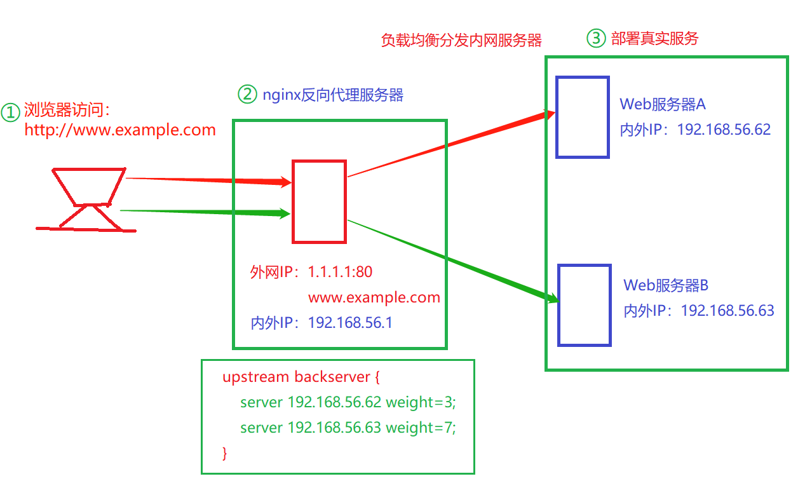

# 01.Nginx反向代理方案

## 1.1 常规部署方案

| 角色              | IP            |
| ----------------- | ------------- |
| nginx反向代理服务 | 192.168.56.61 |
| web01             | 192.168.56.62 |
| web02             | 192.168.56.63 |

 </img>

## 1.2 Nginx反向代理

### 1.2.1 web01和web02安装nginx

- web01配置

```javascript
[root@linux-node4 ~]# yum -y install nginx
[root@linux-node4 ~]# echo web01 > /usr/share/nginx/html/index.html
```

- web02配置

```javascript
[root@linux-node4 ~]# yum -y install nginx
[root@linux-node4 ~]# echo web01 > /usr/share/nginx/html/index.html
```

- 测试nginx服务

```javascript
http://192.168.56.62/    # web01
http://192.168.56.63/    # web02
```

### 1.2.2 nginx反向代理配置

- `安装nginx服务器`

```javascript
[root@linux-node4 ~]# yum -y install nginx
```

- 配置反向代理

```javascript
stream {
    log_format  main  '$remote_addr $upstream_addr - [$time_local] $status $upstream_bytes_sent';
    access_log  /var/log/nginx/django-access.log  main;
    upstream django-apiserver {
                server 192.168.56.62:80;
                server 192.168.56.63:80;
            }
   
    server {
       listen 88;
       proxy_pass django-apiserver;
    }
}
```

- `完整配置如下`(看一下即可，都是nginx默认配置)

```javascript
[root@lb-master ~]# cat /etc/nginx/nginx.conf 
user  nginx;
worker_processes  1;
error_log  /var/log/nginx/error.log warn;
pid        /var/run/nginx.pid;
events {
    worker_connections  1024;
}

stream {
    log_format  main  '$remote_addr $upstream_addr - [$time_local] $status $upstream_bytes_sent';
    access_log  /var/log/nginx/django-access.log  main;
    upstream django-apiserver {
                server 192.168.56.62:80;
                server 192.168.56.63:80;
            }
   
    server {
       listen 80;
       proxy_pass django-apiserver;
    }
}

http {
    include       /etc/nginx/mime.types;
    default_type  application/octet-stream;
    log_format  main  '$remote_addr - $remote_user [$time_local] "$request" '
                      '$status $body_bytes_sent "$http_referer" '
                      '"$http_user_agent" "$http_x_forwarded_for"';
    access_log  /var/log/nginx/access.log  main;
    sendfile        on;
    #tcp_nopush     on;
    keepalive_timeout  65;
    #gzip  on;
    include /etc/nginx/conf.d/*.conf;
}
```

- `测试反向代理可用性`

```javascript
http://192.168.56.62/        # web01
http://192.168.56.63/        # web02
# 可以停止一个nginx服务，测试可用性
```

# 1.3 nginx upstream五中配置

````python
1、轮询（默认）
每个请求按时间顺序逐一分配到不同的后端服务器，如果后端服务器down掉，能自动剔除。

upstream backserver {
    server 192.168.0.14;
    server 192.168.0.15;
}

2、权重 weight
指定轮询几率，weight和访问比率成正比，用于后端服务器性能不均的情况。

upstream backserver {
    server 192.168.0.14 weight=3;
    server 192.168.0.15 weight=7;
}

3、ip_hash（ IP绑定）
上述方式存在一个问题就是说，在负载均衡系统中，假如用户在某台服务器上登录了，那么该用户第二次请求的时候，因为我们是负载均衡系统，
每次请求都会重新定位到服务器集群中的某一个，那么已经登录某一个服务器的用户再重新定位到另一个服务器，其登录信息将会丢失，这样显然是不妥的。
我们可以采用ip_hash指令解决这个问题，如果客户已经访问了某个服务器，当用户再次访问时，会将该请求通过哈希算法，自动定位到该服务器。
每个请求按访问ip的hash结果分配，这样每个访客固定访问一个后端服务器，可以解决session的问题。

upstream backserver {
    ip_hash;
    server 192.168.0.14:88;
    server 192.168.0.15:80;
}

4、fair（第三方插件）
按后端服务器的响应时间来分配请求，响应时间短的优先分配。

upstream backserver {
    server server1;
    server server2;
    fair;
}

5、url_hash（第三方插件）
按访问url的hash结果来分配请求，使每个url定向到同一个后端服务器，后端服务器为缓存时比较有效。

upstream backserver {
    server squid1:3128;
    server squid2:3128;
    hash $request_uri;
    hash_method crc32;
}
````


