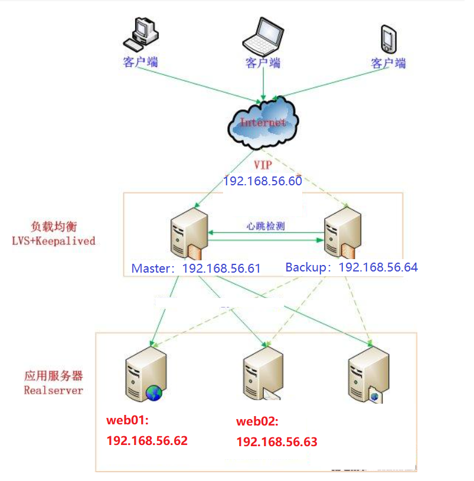

# 01.Nginx+KeepAlive方案

## 1.1 机器规划和架构图

| 角色                             | IP            |
| -------------------------------- | ------------- |
| nginx反向代理+`keepalive-master` | 192.168.56.61 |
| web01                            | 192.168.56.62 |
| web02                            | 192.168.56.63 |
| nginx反向代理+`keepalive-slave`  | 192.168.56.64 |

 </img>

## 1.2 部署nginx负载均衡

-  192.168.56.61（`keepalive-master`）
-  192.168.56.64（`keepalive-slave`）

### 1.2.1 配置nginx负载

- 安装nginx服务

```javascript
[root@linux-node4 ~]# yum -y install nginx
```

- 配置反向代理

```javascript
[root@lb-master ~]# vim /etc/nginx/nginx.conf
stream {
    log_format  main  '$remote_addr $upstream_addr - [$time_local] $status $upstream_bytes_sent';
    access_log  /var/log/nginx/django-access.log  main;
    upstream django-apiserver {
                server 192.168.56.62:80;
                server 192.168.56.63:80;
            }
   
    server {
       listen 88;
       proxy_pass django-apiserver;
    }
}
```

### 1.2.2 完整配置如下

- `看一下即可，都是nginx默认配置`

```javascript
[root@lb-master ~]# cat /etc/nginx/nginx.conf 
user  nginx;
worker_processes  1;
error_log  /var/log/nginx/error.log warn;
pid        /var/run/nginx.pid;
events {
    worker_connections  1024;
}

stream {
    log_format  main  '$remote_addr $upstream_addr - [$time_local] $status $upstream_bytes_sent';
    access_log  /var/log/nginx/django-access.log  main;
    upstream django-apiserver {
                server 192.168.56.62:80;
                server 192.168.56.63:80;
            }
   
    server {
       listen 80;
       proxy_pass django-apiserver;
    }
}

http {
    include       /etc/nginx/mime.types;
    default_type  application/octet-stream;
    log_format  main  '$remote_addr - $remote_user [$time_local] "$request" '
                      '$status $body_bytes_sent "$http_referer" '
                      '"$http_user_agent" "$http_x_forwarded_for"';
    access_log  /var/log/nginx/access.log  main;
    sendfile        on;
    #tcp_nopush     on;
    keepalive_timeout  65;
    #gzip  on;
    include /etc/nginx/conf.d/*.conf;
}
```

### 1.2.3 测试反向代理可用性

- 测试集群可用性

```javascript
http://192.168.56.62/        # web01
http://192.168.56.63/        # web02
# 可以停止一个nginx服务，测试可用性
```

- 服务管理

```javascript
[root@lb-slave ~]# systemctl start nginx
[root@lb-slave ~]# systemctl enable nginx
```

## 2.3 keepalive安装与配置

### 2.3.1 安装keepalive

```javascript
[root@lb-master ~]# yum -y install keepalived
```

### 2.3.2 keepalive-master配置修改

- ==注：默认的keepalived.conf配置太多，直接删除，用下面配置替换即可==
- `192.168.56.61`

```javascript
[root@lb-master ~]# vim /etc/keepalived/keepalived.conf 

global_defs { 
   notification_email { 
     acassen@firewall.loc 
     failover@firewall.loc 
     sysadmin@firewall.loc 
   } 
   notification_email_from Alexandre.Cassen@firewall.loc  
   smtp_server 127.0.0.1 
   smtp_connect_timeout 30 
   router_id NGINX_MASTER
} 

# 健康监测nginx
vrrp_script check_nginx {
    script "/etc/keepalived/check_nginx.sh"      # 设置检查nginx是否存活的脚本位置
}

# keepalive热备组配置
vrrp_instance VI_1 { 
    state MASTER            # 配置当前keepalive为master角色
    interface eth0           # 网卡名字，必须和实际网卡名称一致，默认是ens33
    virtual_router_id 51       # VRRP 路由 ID实例，每个实例是唯一的 
    priority 100            # 优先级，备服务器设置 90 
    advert_int 1            # 指定VRRP 心跳包通告间隔时间，默认1秒 
    authentication { 
        auth_type PASS      
        auth_pass 1111       # 设置keepalive的master和slave之间简单的秘钥认证
    }  
    virtual_ipaddress { 
        192.168.56.60/24     # 设置keepalive虚拟IP地址
    } 
    track_script {
        check_nginx
    } 
}
```

### 2.3.3 keepalive-slave配置修改

- ==注：默认的keepalived.conf配置太多，直接删除，用下面配置替换即可==

- `192.168.56.64`

```javascript
[root@lb-master ~]# vim /etc/keepalived/keepalived.conf 
 
global_defs { 
   notification_email { 
     acassen@firewall.loc 
     failover@firewall.loc 
     sysadmin@firewall.loc 
   } 
   notification_email_from Alexandre.Cassen@firewall.loc  
   smtp_server 127.0.0.1 
   smtp_connect_timeout 30 
   router_id NGINX_BACKUP
} 

vrrp_script check_nginx {
    script "/etc/keepalived/check_nginx.sh"
}

vrrp_instance VI_1 { 
    state BACKUP            # 设置keepalive角色为backend
    interface eth0           # 设置虚拟网卡名称
    virtual_router_id 51       # VRRP 路由 ID实例，每个实例是唯一的，master和slave保持一致即可
    priority 90             # 优先级，备服务器设置 90 
    advert_int 1            # 指定VRRP 心跳包通告间隔时间，默认1秒 
    authentication { 
        auth_type PASS      
        auth_pass 1111 
    }  
    virtual_ipaddress { 
        192.168.56.60/24     # 设置虚拟网卡地址
    } 
    track_script {
        check_nginx
    } 
}
```

### 2.3.4 添加nginx健康监测脚本

```javascript
[root@lb-master keepalived]# vim /etc/keepalived/check_nginx.sh
#!/bin/bash
count=$(ps -ef |grep nginx |egrep -cv "grep|$$")

if [ "$count" -eq 0 ];then
    exit 1
else
    exit 0
fi
[root@lb-master keepalived]# chmod +x /etc/keepalived/check_nginx.sh         # 给脚本添加一个可执行权限
```

### 2.3.5 启动keepalive

```javascript
[root@lb-master ~]#  systemctl start keepalived
[root@lb-master ~]#  systemctl enable keepalived
```

## 2.4 测试keepalive高可用

- 测试使用 http://192.168.56.60:88/ 虚拟IP访问
     - 在浏览器中访问: http://192.168.56.60   http://192.168.56.61   http://192.168.56.64  都可以访问web1和web2服务
- 关闭lb-master（192.168.56.61）的nginx测试VIP是否漂移到备节点
     - 在192.168.56.61中停止nginx服务（lb-master）,lb-slave中可以接替master的服务
     - 依然可以使用 http://192.168.56.60:88/ 访问web01和web02服务

 </img>

