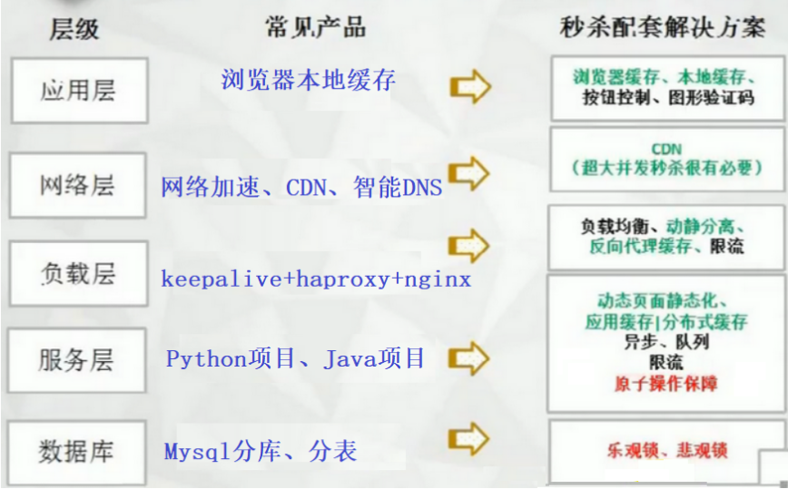
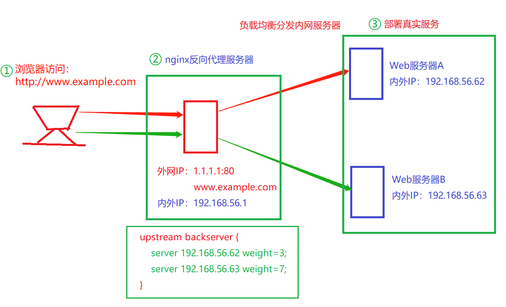

- 秒杀系统部署
- 高并发项目整体架构部署（500万日活项目部署）
- 大体先梳理项目中的技术点（结合实验楼分析项目整体架构和技术点）

# 01.秒杀系统架构

## 1.1 超卖问题

- 1000件商品
- 第一步查询商品数量
- 查询商品：A 读 商品 1000 B 读 商品 1000
- 扣减库存：A : 1000-1 =999写入数据库，B：1000-1=999
- 卖了两件商品，商品数量：999

## 1.2 乐观锁和悲观锁如何解决超卖问题的

- 悲观锁解决的原理
  - A读商品数量是1000,如果要是悲观锁，A读完数量后商品就加锁（`排它锁`）了
  - B过来商品数量，A加的锁还没有释放，所以B要等待
  - 只有当A卖完商品，商品数量减一，把商品数量为 999重新写入到数据库才释放锁
  - B获得商品时商品数据量是999而不是1000
- 乐观锁解决的原理
  - A读商品数量是1000,如果要是乐观锁这一刻乐观锁没有加锁
  - A进行商品扣减的时候会校验，现在的商品数量是否和开始数量一致
  - A`扣减`（排它锁）之后要不999写入到mysql中时会校验商品数量是否是1000
  - 和A刚开始读的数据一致就写入，不一致重试

# 02 各层解决方案

## 2.1 分层结构图说明

 </img>

## 2.2 网络层 CDN

- `特点：`CDN服务器不需安装部署，不是一个真实的后端服务器，仅仅缓存了前端数据
- `作用：`减轻源站的服务器压力，对于国外访问，可以更快速
- CDN不是把我们的服务部署在全世界各地（成本太高）
- CDN是静态资源的缓存（JS，Html、Css、图片、视频），不会变
- 网站提供是一个后端API接口
- 你从没过打开的商家的商品图片来美国的一台CDN服务器
- 但是请求的API接口，后端服务可能还是部署在中国
- 需要和数据库动态交互的，CDN没有任何作用

> #### 2.负载层（高可用）

- `nginx负责均衡：`https://www.cnblogs.com/xiaonq/p/10468998.html

- `问题：`只能解决高并发，不能解决高可用

   </img>

  - keepalive和lvs、haproxy有了解（解决高可用问题）

  - keepalive：https://www.cnblogs.com/xiaonq/p/11694253.html

  - 解决了单点故障

     </img>

# 03.高并发架构各层能做的事情

- 应用层
  - 浏览器本地缓存：缓存静态页面、缓存加入购物车的数据
- 网络层
  - CDN缓存静态资源：html/css/js/图片
- 负载层（高并发、高可用）
  - keepalive(haproxy)+nginx反向代理（腾讯云LB、阿里云的SLB）
- 服务层
  - 动态页面静态化（比如Django的cache服务），减少查询数据库的次数
  - 借助redis缓存解决大量的mysql查询压力
  - RabbitMQ+异步解决mysql的大量写入问题
  - 限流：
    - `抢购：`nginx设置了保护功能，当流量过大自动丢弃（负载层就丢弃了）（`nginx过载保护`）
    - 同一个设备、账号、出接口ip 一秒钟最多访问次数
- 数据库层
  - 解决超卖问题：乐观锁、悲观锁解决数据安全
  - mysql一主多从，读写分离：写主库，读从库（所有数据库的数据一样）
    - 数据一样的，那么当数据量太大的时候查询还是很慢
  - 分库（根据用户id分库）
    - 所有数据库的表结构一样，存储的数据完全不一样
    - 真实环境以用户id进行分库，每一个库的数据都很小，查询起来就快了
    - 无法解决问题：当一个数据库中表中量过大的时候，查询依然会慢
  - 分表（根据时间分表）
    - 当一个表中数据过大的时候，我们必须要对表拆分
    - 购物清单表中有两千万数据
      - 最近半年的购物数据时 一百万
      - 半年到一年的数据有五百万
      - 一年以前的数据有一千万