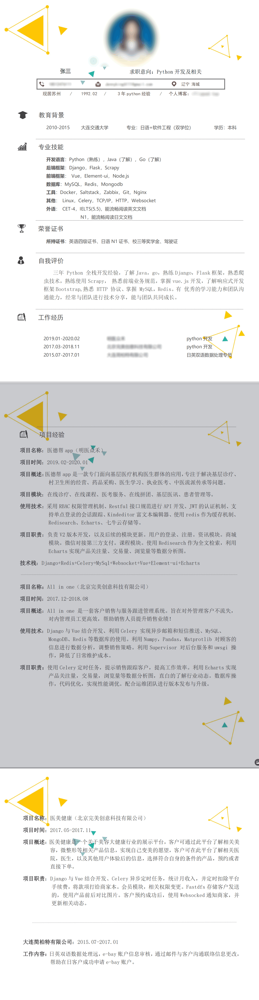
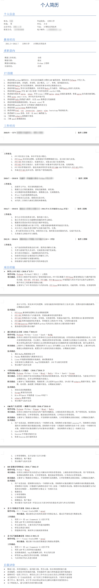
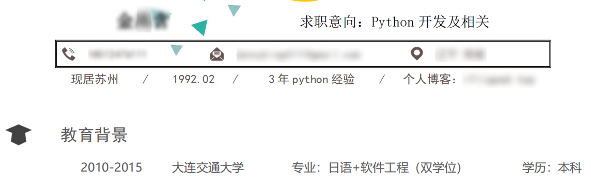
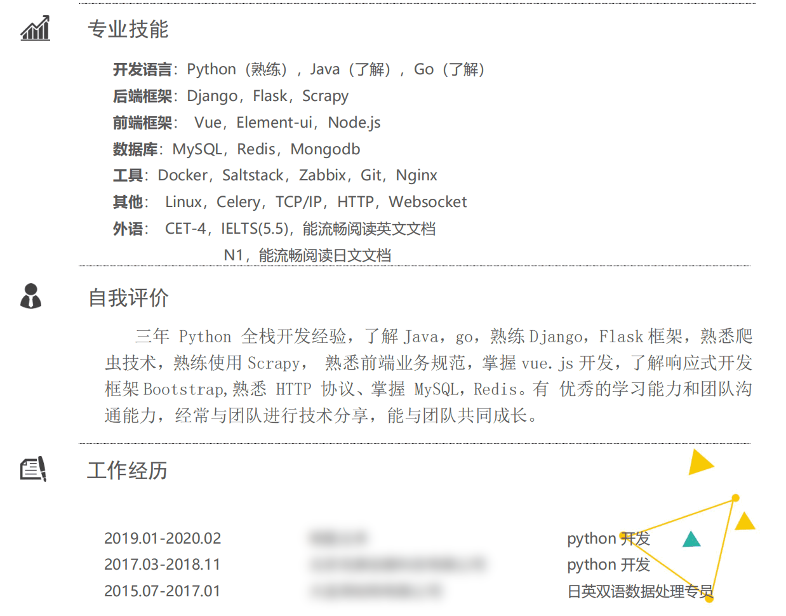
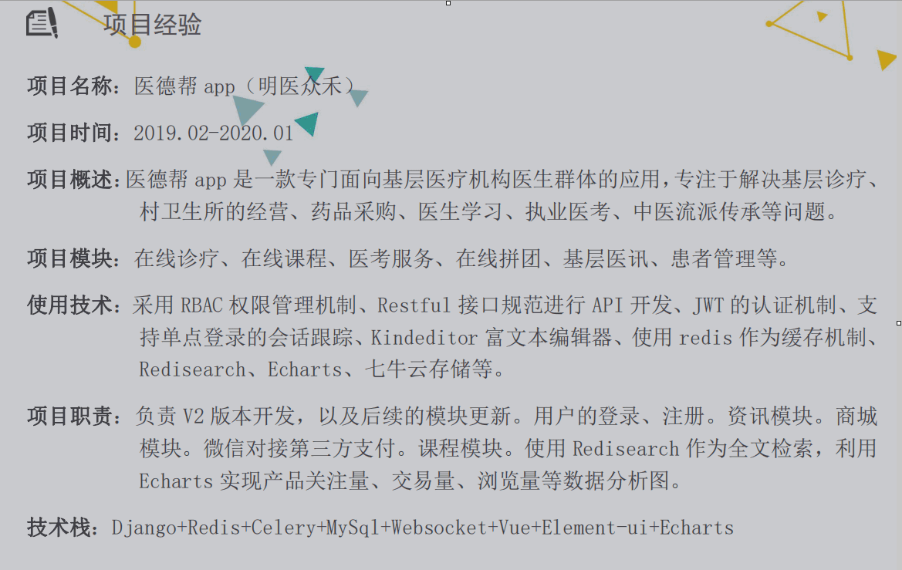
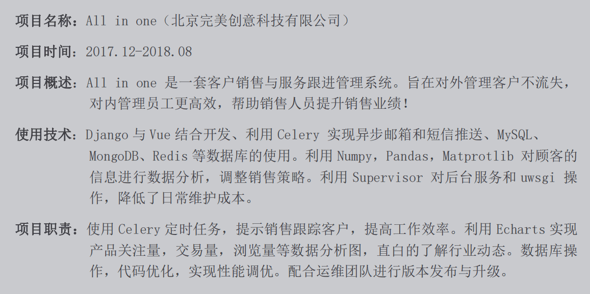
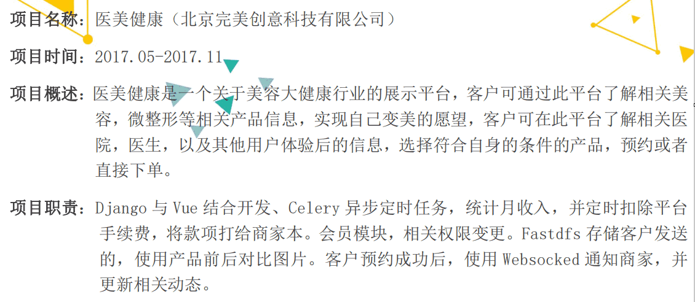

`找工作要准备的事情`

````
1.A简历
2.B简历（详细的 技术点+项目业务）
3.面试题
4.模拟面试
5.材料准备：社保、学历、银行流水
````

## 01.简历展示

### 1.1 简历(金xx)

 </img

### 1.2 讲师简历

 </img>

## 02.简历模块分析

### 2.1 基本信息&教育背景

 </img>

### 2.2 专业技能

 </img>

### 2.3 项目经历

#### 2.3.1 医德帮（明医众禾）

 </img>

#### 2.3.2 All in one(北京完美创意)

 </img>

#### 2.3.3 医美健康(北京完美创意)

 </img>