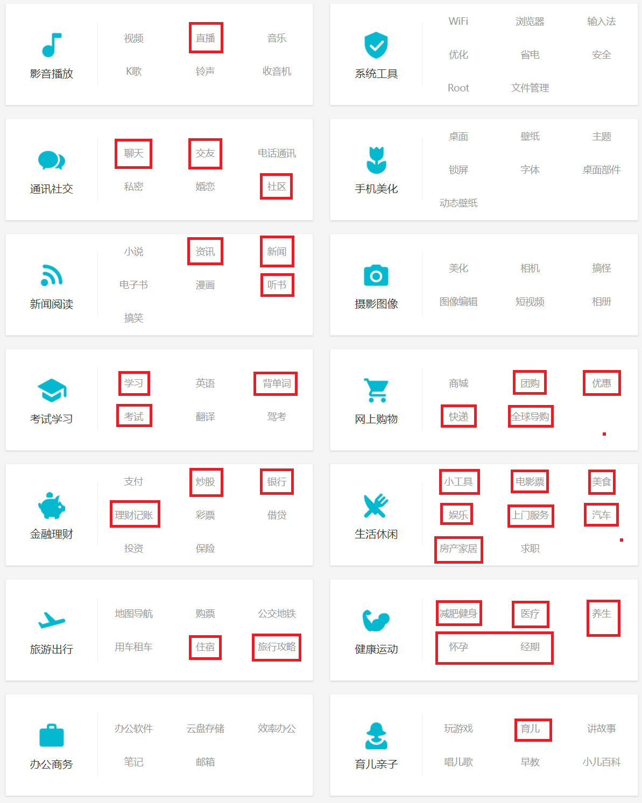
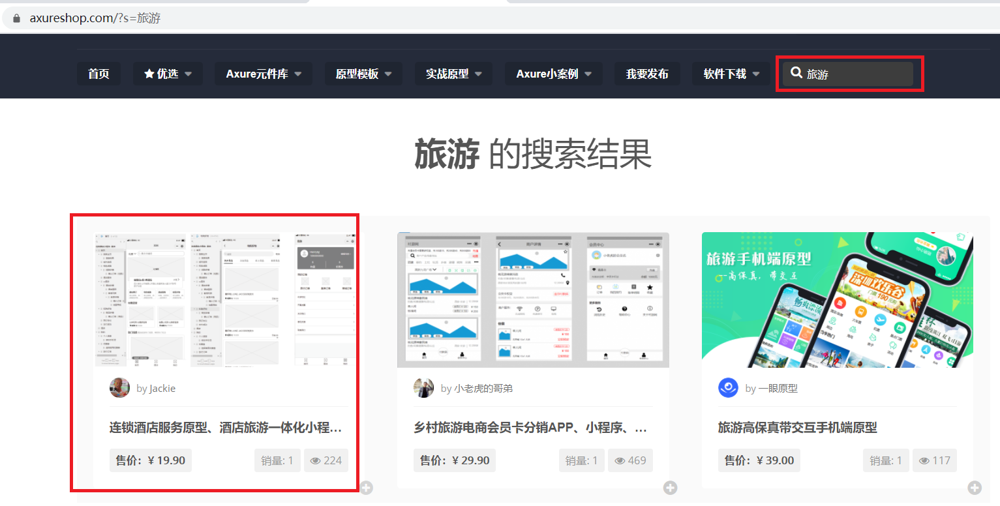
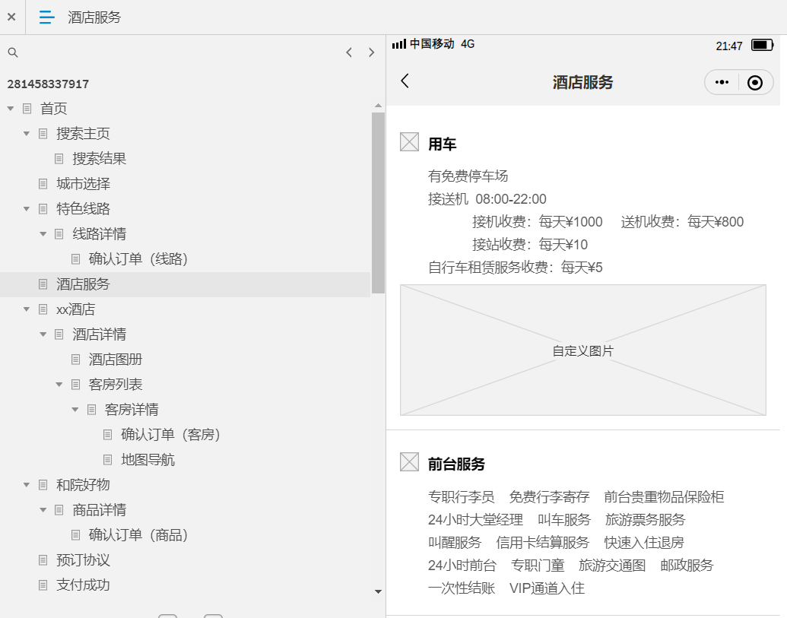

## 01.如何找项目

### 1.1 找项目几个步骤

- 第一：确定行业
- 第二：确定项目
- 第三：确定项目内容
     - 项目描述
     - 项目职责
     - 项目中技术点

### 1.2 找项目参考网站

- `参考网站`

```javascript
###### 01.如何找项目
## 1.1 豌豆荚APP,找项目
https://www.wandoujia.com/category/app
## 1.2 axureshop网站找项目原形
https://www.axureshop.com/

###### 02.找项目文档 
## 2.1 百度文库、道客巴巴、豆丁（使用"旅游app项目文档"这种关键字来搜索）
https://wenku.baidu.com/
https://www.doc88.com/
https://www.docin.com/

###### 03.项目技术
## 3.1 也可以到git仓库找项目
https://gitee.com/    
https://github.com/  


猪八戒(百度搜项目类型，找第三方收费项目，跟他们要资料)：https://beijing.zbj.com/
一品威客（百度搜项目类型，找第三方收费项目，跟他们要资料）：https://www.epwk.com/
36氪： https://36kr.com/enterprise
行业知识库：https://www.useit.com.cn/forum-277-1.html
cnnic行业报告：http://www.cnnic.net.cn/hlwfzyj/hlwxzbg/
开源中国：https://www.oschina.net/
```

## 02.完成简历

### 2.1 豌豆荚-确定项目选型

[豌豆荚](https://www.wandoujia.com/category/app)

 </img>

### 2.2 axureshop-原型图梳理项目

#### 2.3.1 首页搜索项目

[axureshop原型](https://www.axureshop.com/)

 </img>

#### 2.3.2 查看原型图

 </img>

### 2.3 找项目文档

- [百度文库](https://wenku.baidu.com/)
- [道客巴巴](https://www.doc88.com/)
- [豆丁](https://www.docin.com/)

```python
###### 02.找项目文档 
## 2.1 百度文库、道客巴巴、豆丁（使用"旅游app项目文档"这种关键字来搜索）
https://wenku.baidu.com/
https://www.doc88.com/
https://www.docin.com/
```