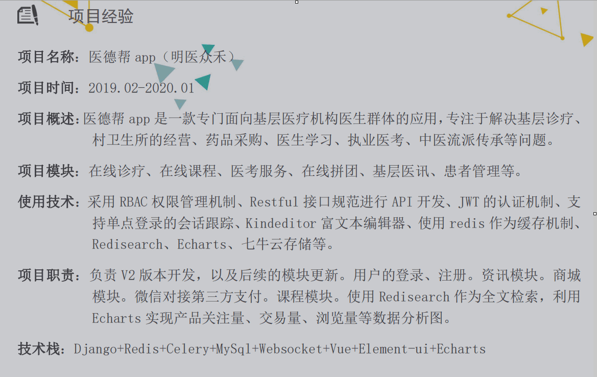

## 01.一：基本信息&教育背景

### 1.1 案例

 </img>

### 1.2 注意事项

- `1、项目经验一般正常是3年`
- `2、年龄：24~25岁（21~22岁毕业）`
- `3、最好有个人博客 和 gitee、GitHub地址`
- `4、学历都是本科`

### 1.3 `自我介绍(面试)`

`刘悦老师：`https://www.bilibili.com/video/BV1da4y1J7yE

#### 1.3.1 项目介绍说明

- <span style="color: red"> 自我介绍就是自我推销的过程，要有凭有据，实事求是，切记假大空的套话。建议可以从以下四点来自我介绍，但是仅仅是建议，自我介绍没有一成不变的。</span>

- <span style="color: red"> **① 基本信息介绍**</span>

- <span style="color: red"> **② 做过什么？学到了什么？做成了什么？**</span>
     - 介绍项目时除了业务，最好还要加上技术栈
     - **后台管理页面+后端接口+运维部署(结合云服务)**
- <span style="color: red"> **③ 擅长做什么？**</span>
- <span style="color: red">**④ 凸出自己好学，解决问题能力强**</span>

- <span style="color: red"> 1.多少年开发经验、2.web框架相关、3、数据库和缓存相关、4、部署相关、5、前端页面+后台管理页面+后端接口+运维部署</span>

- 做好上面准备还差的就是自信而不失礼貌的微笑，目光不要闪躲，切忌飘忽不定，学会微笑，微笑是国际通用语言。 

#### 1.3.2 通用版

```python
## 1)基本信息介绍
面试官您好，我叫xxx，今年26岁，家在辽宁。今天，来面试python开发这个职位。
## 2)做过什么
我是17年6月的时候毕业的，在两家公司就职过，先后参与过4个项目的开发，主要包括股票、校园服务平台、机器人自动化以及缴费平台。
## 3）擅长做什么
我有3年的python开发经验，熟悉Django、Flask等多个后端框架，以及Vue、Bootstrap等多个前端框架，了解的数据库有mysql、mongodb、ES等，会使用Git、Docker工具，对restful风格代码有极致追求。
## 4）凸出自己好学，解决问题能力强
我觉得我最大的核心竞争力就是具有较好的逻辑分析能力和一定的解决问题的能力，我一直都以成为一个优秀的架构师为目标。
我期望加入贵公司，并与公司携手共赢，谢谢。
```

#### 1.3.3 假装老鸟版

```python
我是17年毕业的，最近三年主要负责python后端开发；
上家公司在内蒙古金财，主要负责 机器人自动化平台和金牛缴费平台研发工作，在这里我前端和后端都有参与，前端主要用的是vue框架，后端主要用django框架，测试环境采用Docker容器化部署，线上环境部署在阿里云，使用SLB和nginx
在这之前，我在清华科技做过一年多，主要负责自动化工单系统和监控系统的自动化平台开发；
您看，还有什么需要了解的
```

## 02.二：专业技能

### 2.1 案例

 </img>

### 2.2 注意事项

- 1、`专业技能要按分类写`（千万不能全班都用一种格式）
- 2、`开发语言最好能写了解，java或者php或golang相关框架(与培训简历区分开)`
- 3、工作经历：
     - 时间：`一般都是两家公司`（时间周期一年以上，不要出现几个月的公司经历）
     - 地点：`地点最好是在同一个城市`（`千万不要第一家在上海，第二家在深圳，求职目的地在北京`）


## 03.三：项目经历

### 3.1 案例

- [github地址](https://github.com/macrozheng/mall)
- [安卓app前端](http://www.macrozheng.com/app/index.html)
- [后台管理端](http://www.macrozheng.com/admin/index.html)

```
账户：admin
密码：macro123
```

 </img>

### 3.2 注意事项

- 时间周期：`6个月到一年比较合适`
- 项目选型：
     - `在豌豆荚里进行挑选，不要选电商项目`
     - 建议挑选一些行业内的小型app，不知名的
- 项目组成：
     - 项目描述
     - 项目职责
     - 项目技术点

### 3.3 项目描述（一）

- <span style="color: red"> 这是一个怎样的项目？（用一句话概括即可） </span>
- <span style="color: red"> 项目给谁用？一定要有定位 (如：销售、HR、编程爱好者、全球所有有网购需求的人 等)</span>
- <span style="color: red"> 用来做什么？怎木用？(要结合项目中的功能来说)</span>
- <span style="color: red"> 给用户带来什么好便利？解决了什么问题？</span>

> `案例一：实验楼`
>
> 该平台是一个线上教育平台，核心模块包括用户模块、课程模块、在线编程、评论社区、课程优惠等。主要为各大高校提供知名大师网上授课服务，购买高级讲师课程的学生对课程不懂的知识点可和讲师互动。课程还有配套的课外作业，并且提供WebSSH在线编程环境，方便用户学习。

### 3.4 项目职责（二）

- `最好根据项目选型，写一些业务相关的内容，更有真实性`
- 具体内容较多，`请参考下面 "项目职责业务"部分`

```
前端：vue ant-design  element-ui echars websocket  axios  bootstrap  hexo  
后端：django flask  drf  restful  scrapy 
数据库：mysql主从   Redis哨兵/codis    ES    mongodb  rabbitmq
部署：nginx   uwsgi  gevent   docker   k8s   keepalive  
三方：七牛云、视频直播、即时通讯、支付、三方登录
```

- mail商城举例说明

 </img>

### 3.5 项目中技术点（三）

- 使用Redis实现分布式部署单点登录（单点登录第一种方法：redis分布式存储解决方案）
- 基于JWT技术及RSA非对称加密实现真正无状态的单点登录（单点等第二种方法：JWT）
- 用户登录对接QQ、微信、微博等三方登录
- 基于 Django 的后台管理平台，采用 RBAC 权限管理机制
- 结合DRF框架提供标准RESTful API接口
- 借助xterm.js、paramiko、Dwebsocket、SSH完成WebSSH在线编程
- 使用Ckeditor富文本编辑器完成后台管理
- 使用websocket完成在线直播推送消息
- redis集群实现秒杀和解决超卖问题
- 集成支付宝、微信、银联等进行聚合支付(怎么保证接口安全)
- 课程加入路径celery触发更新提醒
- 借助celery定时任务检查会员过期，过期改为普通会员
- 基于LocalStorage实现离线客户端购物车，减轻服务端压力。
- 基于Redis搭建高可用集群，实现可靠缓存服务即热点数据保存。redis持久化，集群，哨兵，主从，缓存击穿，热点key。
- 基于Redis和Mq来应对高可用高并发的秒杀场景
- 集成阿里云，视频采集、编辑、上传、分发加速、视频播放等
- 借助阿里云SLB对多台云服务器进行流量分发的负载均衡服务
- 使用nginx反向代理实现初步的请求负载均衡和请求限流，实现负载层水平扩容，消除单点故障提升应用系统的可用性
- 基于mysql实现数据库的读写分离和分库分表
- mysql解决超卖问题
- **使用Elasticsearch全文检索**
     - ES聚会索引
- **使用协同过滤算法实现课程推荐**
- **使用Supervisor对后台服务和uwsgi操作，降低日常维护成本**
- 线上服务发布过程（灰度发布）
- 排行榜实现
     - es / redis

- echarts
- mongodb评论
- docker+k8s

### 3.6` 项目介绍（面试）`

[mail商城](https://github.com/macrozheng/mall)

> `mial商城项目`
>
> `mall`项目是一套电商系统，包括前台商城系统及后台管理系统，基于SpringBoot+MyBatis实现，采用Docker容器化部署。前台商城系统包含首页门户、商品推荐、商品搜索、商品展示、购物车、订单流程、会员中心、客户服务、帮助中心等模块。后台管理系统包含商品管理、订单管理、会员管理、促销管理、运营管理、内容管理、统计报表、财务管理、权限管理、设置等模块。

> `案例一`
>
> 统一缴费平主要做的是为多个平台提供缴费功能，线下和浦发等多个银行和平台都有合作。
>
> 是前后端分离开发的，前端采用是Vue和ant-design搭建的，后端是Django结合DRF框架，
>
> 数据库用到了Mongodb和redis，还有一部分数据储存到了mysql，
>
> nginx和uWSGI上线部署的，实现了负载均衡效果。

> `案例二`
>
> 此项目是一个基于Django和Vue开发的统一缴费平台，
>
> 核心模块包括用户模块，高校模块，医疗模块等，为多个平台提供缴费功能，和多个银行都有合作，同时支持票据生成等功能。

> `案例三`
>
> 孕期记录是专为准妈妈设计的基于CS架构的APP，其中包含用户认证，添加宝宝，跟踪宝宝状态，孕育问答，营养查询，孕妈必读，胎动记录等模块。从备孕到宝宝出生，这款软件都贴心的记录准妈妈每天的身体状况，同时，系统还会推荐最健康的食谱、孕期知识等，更会提供专业的孕育问答，帮助准妈妈和宝宝健康成长。

> `案例四`
> 互联网医院app是一款专门针对患者和医生使用的，将传统医疗与新型互联网技术有效结合，实现线上线下服务一体化、诊前诊中诊后服务一体化的一款app。可以让患者进行快速问诊，挂号，处方查询，医生查询，用药提醒，健康科普，评价，举报等一些操作

## 04.项目职责业务

### 4.1 通用版

#### 4.1.1 前期

- 负责`前期需求对接，整理需求文档以及原型设计`
- `负责数据库设计`，使用Axure设计部分产品原型
- 负责协调开发人员、分配任务以及进度监控（项目经理职责）
- `负责线上接口文档的编写`

#### 4.1.2 后期

- 使用postnam进行接口测试
- 跟甲方人员和前端人员进行接口联调
- 配合测试使用jmeter进行接口压测
- 配合测试人员进行bug评审、分配（禅道）和修改
- 项目测试环境搭建以及MySQL、ES等环境安装
- 负责线上异常处理、线上服务器监控

#### 4.1.3 项目中期

- 负责首页轮播图广告以及站外广告的管理展示
- 负责ES聚合热门商家以及付费推广商家的推荐
- 使用ES进行搜索以及聚合查询xxx（写具体的种类，例如：景区）列表
- 使用celery+redis实现页面（写具体的种类的详情，例如：景区详情）静态化处理
- 负责支付宝以及微信支付开通流程，以及对接支付宝支付以及微信支付
- 对接个推（或者极光推送）实现APP以及网站消息推送
- 负责对接网易易盾对xxx（xx商品或者景点、消息、评价等）内容审核
- 使用rabbitmq对MySQL数据和elasticsearch以及静态页面的数据同步
- 负责全站广告动态展示以及定时上下架处理
- 对接阿里云OSS、短信服务等第三方接口


### 4.2 商城项目

- 负责对接快递100（或者快递鸟），实现应用内预约快递、发快递以及实时追踪快递信息
- 负责月度、季度、年度销量报表处理
- 负责国际免税专区的商品的维护以及展示
- 负责商家付费广告线上申请、付费、时间段维护以及续费功能
- 负责猜你喜欢模块的推荐内容算法（分为未登录用户，就是按照地区和销量来了推荐，以及登录用户，就是按照用户购买的商品来推荐）
- 负责会员模块的开发和设计，包括VIP和超级VIP的包月、包年以及续费和续期操作
- 负责会员商品模块的推荐（主要就是根据所有会员的兴趣推荐的和付费推广的商品）
- 负责企业客户采购通道的维护（单独的大客户入口，购买数量会有所限制，商品价格会有所降低）
- 负责商品订阅功能以及商品上下架和降价的用户通知（MQ+个推实现）
- 负责退换货流程的线上处理申请（线上申请，线下客服处理）
- 负责积分商城的商品维护以及兑换
- 负责客服中心的疑难解答、售后流程、以及维权模块的指引
- 负责0元购（一元购）活动的商品维护以及活动开展
- 负责对接百度AI实现手机端拍照识别商品功能

### 4.3 旅游项目

- 负责地图找景点功能（就是在地图上把所有景点都列举出来，然后买票）

- 负责用户所在地的景区推荐以及热门景区的展示

- 负责一日游功能的后台维护功能

- 负责第三方景区电子门票的对接（入园分为三种方式：线下取票、电子门票以及身份证入园）

- 负责线上退票流程操作（主要是提交退票申请，然后支付宝微信申请退款操作）

- 负责对接第三方系统实现用户信息的识别

- 负责使用MongoDB实现景区评价以及追评功能

- 负责旅游周边产品的售卖（商城那一套就行）

- 负责抓取第三方新闻网站的的景点新闻（爬虫）以及周边天气信息的推荐


### 4.4 教育项目

- 使用腾讯实时音视频进行一对一直播模块的对接，以及使用互动直播进行一对多直播（推流、拉流）
- 负责使用MongoDB实现课程评价以及追评功能
- 负责使用定时任务实现课程预约模块
- 负责第三方微信登陆以及微信分享功能
- 负责名师课堂的推荐
- 负责课程组合模块的维护和购买
- 负责个人以及机构入驻的审核功能
- 负责机构付费广告线上申请、付费、时间段维护以及续费功能
- 负责课程的开课短信以及邮箱通知
- 负责热门活动的开展以及优惠券的发放和使用，以及优惠券的防伪加密操作
- 负责机构课程的课程码兑换功能
- 负责个人以及讲师课程表的维护以及通知功能
- 负责后台讲师以及个人用户的使用情况统计


### 4.5 二手车

- 负责抓取第三方新闻网站的的二手车行业新闻（http请求+dom4j解析）
- 负责买车流程、卖车流程的展示以及维护
- 负责金融分期方案的维护
- 负责二手车问答模块的用户提问以及互动答疑、最佳答案等审核以及展示
- 负责二手车论坛模块的维护，以及用户权限的区分
- 负责积分商城的维护以及积分兑换
- 负责二手车辆线上审核以及资料审核
- 针对用户发布的价格做评估以及鉴定
- 负责二手车订阅功能以及上下架和降价的用户通知
- 负责APP以及网站接口的提供


### 4.6 社区项目

- 负责进行小区住户，房屋以及车辆的统计

- 负责用户推荐的纬度维护

- 根据对接门禁系统，获取用户出行信息，精准推荐每个时间点的展示的内容

- 根据用户家庭情况，个性化推荐需要的商品

- 负责对接园区智能机器人，分析图像以及视频数据进行园区安全维护

- 负责对接无人机实时监控小区安全，对接百度AI针对危险行为作出预警

- 对接周边商家的活动展示以及线上购物

- 根据用户出行数据，对接百度地图，实现小区周边交通情况实时预报

- 负责小区人员跑腿业务的发起、接单、以及配送监控功能

- 对接支付宝支付、微信支付

- 负责优秀跑腿员的推荐、认定以及评级

- 使用jwt实现单点登录

- 负责使用MongoDB实现跑腿员的评价以及追评功能

  ​      


### 4.7 分销系统

- 负责销售出库模块中对产品码的判断以及对出库单据的审核

- 负责经销商和销售区域的展示，在产品出/入库之后及时更新库存

- 负责销售入库模块中对入库订单的审核和扫码收货入库功能

- 负责实现厂区系统和分销系统之间产品信息的同步

- 负责推荐注册以及利润分成功能
- 负责打包入库以及打包出库、车辆中转、分批中转功能
- 使用redis实现推荐码失效以及跟OA系统对接的功能
- 实现车辆实时定位功能
- 负责车辆ETC的对账以及缴费功能
- 负责车辆的报修、审核、报废、保险的维护（ERP（企业资源管理系统））
- 负责个人车辆申请以及审核