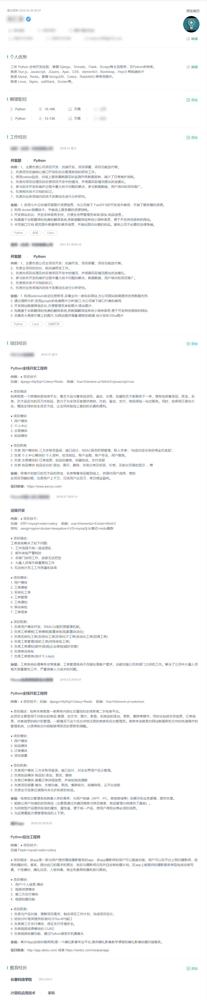

## 01.简历审核

### 1.1 审核项

| 打分项         | 是否通过 | 说明                                                         | 建议 |
| :------------- | -------- | ------------------------------------------------------------ | ---- |
| **年龄**       | √        | 年龄必须在24岁及以上，工作时间至少两年                       |      |
| **简历整洁度** | √        | 简历模板简单整洁                                             |      |
| **简历排版**   | √        | 必须要整洁，字体，字号，标题，空格都要有统一规范，紧凑有条理 |      |
| **项目时间**   | √        | 项目时间周期至少大于六个月，项目时间间隔不大于一个月         |      |
| **技能列表**   | √        | 技能列表安类写，最好写一些了解其他语言及其框架               |      |
| **自我评价**   | √        | 切记假大空，写一些实际的内容即可                             |      |
| **工作经历**   | √        | 建议两家公司，四个项目，三年工作经验最好                     |      |
| **项目选型**   | √        | 不要写小型购物网站,微信公众号等，可以找一些行业内真实的app分析 |      |
| **项目描述**   | √        | 说清楚，是什么？给谁用？做什么？怎么用？                     |      |
| **项目职责**   | √        | 后台管理、后台接口、部署                                     |      |

### 1.2 上线注意

- Hr不能直接看到附件中的简历，除非花钱下载，一份简历从十几块钱到几十块钱不等
- 所以把简历放到页面的内容一定要好好写
- boss上HR智能看到一些基本信息，可能连项目都看不到，智联可以看到一些项目相关的

### 1.3 简历赛选项

 </img>

## 02.上线案例

### 2.1 案例一

 </img>

### 2.2 案例二

 </img>

### 2.3 案例三

 </img>