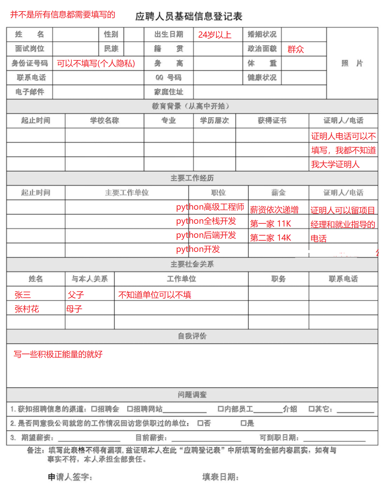

## 01.简历头像

- 简历头像要正式，着装要注意
- 不要贴一个特别丑的生活照或者大头贴
- `案例一`

 </img>

- `案例二`

 </img>

## 02.面试着装

- 着装不能太休闲
- 出门面试注意形象
     - 衣着要整洁
     - 身上不能有异味
     - 头发不能太飘逸
     - 奇装异服禁止（男孩打耳钉、男孩留长发、冲天揪）
     - 女孩化淡妆，不要太浓，最好不要素颜

## 03.面试礼貌

- 要求
     -  仪表要端庄大方，站有站相，坐有坐样，举止文明，彬彬有礼
     -  打招呼时要使用礼貌用语，称呼要得体
     -  礼节要有分寸，待人的原则是不卑不亢
- 具体细节
     - 面试前一天主动和面试官（HR）确定好面试时间，如有变动提前告知
     - 同乘电梯，用手挡着电梯防止电梯关闭，让面试官先走
     - 面试官过来，站起来主动和面试官打招呼
     - `一定要记得微笑，微笑是国际通用语言`
- 如果记不住，那就记得一句话：`胆大心细脸皮厚，不卑不亢要有理`

## 04.boss直聘聊天用语

- <span style="color: red"> 千万千万不要用系统常用语</span>
- 如何和boss打招呼，提供成功概率（不同人员不同称呼）
- 别人不回复可以反复发送，直到回复为止，<span style="color: red">！！！ 每次发送，消息都会置顶</span>
- 如果别人说你简历不匹配，要谦虚的询问那一块不匹配（<span style="color: red"> 可能你的线上或线下简历被人看出问题啦</span>）

```python
黄女士（黄总）您好，我最近三年一直从事Python研发工作，
对Django、Flask框架很熟悉，常见的Mysql、Redis、MongoDB数据也经常使用，熟悉Linux环境开发，对运维工作也有很多了解。
刚刚仔细看了咱家的招聘需求，感觉非常的匹配，期待能和您进一步沟通，期盼您的回复，谢谢！
```

## 05.添加社交主页

- 可以是 博客、github、gitee、个人搭建的网站 等（一定要有质量，注意时间）
- 可以不是自己的，比如你发现一个人写的经历和技能和自己都比较相似，写的比较好，就可以写成自己的

## 06.简历命名格式

```
_张三_python开发_三年.pdf
_姓名_职位_工作经验.pdf
```

## 07.学历和年龄问题

- 面试被问到学历问题这个是无法避免的，但是一定要放松心态
- 每年毕业几千个学长，学姐，都能面试都没问题，现在工作也很正常，不用太担心
- 正常HR有招聘要求，他们也特别期待你能入职，所以只要公司没有明确规定，都不会太严格

- `问题1：你有学信网学历吗？`
     - 有
- `问题2：是全日制还是…`
     - 是全日制
- `问题3：你的学历是学信网还是民教网`
     - 这种就说是民教网

- `入职被查学历怎么办？`
     - 入职被查学历也是有可能的，这种情况要摆正心态，和HR认真沟通
     - 如果学历是硬性要求，那就换一家继续面
          - 入职一家公司查学历有可能，但是
          - 到目前为止还没有一个同学入职三家公司都被查的

- `年龄问题怎么办？`
     - 其实真实年龄和身份证对不上是很正常的
     - 情况1：早些年计划生育，所以很多家庭为了避免罚款，都会把二胎孩子年龄少写几岁
     - 情况2：当时报户口本的时候填错了，这个很普遍，就是地方派出所填写的，错误概率非常大

## 08.长期面试没有offer怎么办

- 到目前为止还没有遇到听话，愿意面试的同学找不到工作的
- 长期面试无果，也许是没有安装讲师的话去执行
- 这个时候也不用太担心，联系一下老师，到学校去做一下复盘
- 找到具体问题，针对性解决
- 只要安装要求做，没有找不到工作的

## 09.离职了怎么办

- 凡事有因有果，在被人学习的时候偷懒了，就需要在后面的时间去补
- 每个班里都会有一个到两个同学由于技术问题出现离职
- 这种情况也不要太担心，只要你能正常入职，哪怕一家公司，至少证明你的面试能力没问题
- 哪怕你第一家公司干了两周，那你就定一个小目标，下个公司能干三周…..
- 只要自己不放弃，能坚持两到三个月时间，能力也能提升，很快就能应付工作的问题啦

## 10.入职背调信息填写

```
留的背调人信息：肖经理（项目经理）
公司名称：xxx有限责任公司
入职时间：2019.01.14
离职时间：2020.02.20
工作内容：医德帮app是一款专门面向基层医疗机构医生群体的应用，专注于解决基层诊疗、   村卫生所的经营、药品采购、医生学习、执业医考、中医流派传承等问题。医德帮app  负责V2版本开发，以及后续的模块更新。后台管理模块。用户的登录、注册。   资讯模块。商城模块。微信对接第三方支付。课程模块。消息推送。使用    Redisearch作为全文检索，利用Echarts实现产品关注量、交易量、浏览量等   数据分析图。
离职原因：年后一开始想去日本，后来疫情，加上爷爷生病
```

## 11.应聘登记表

 </img>