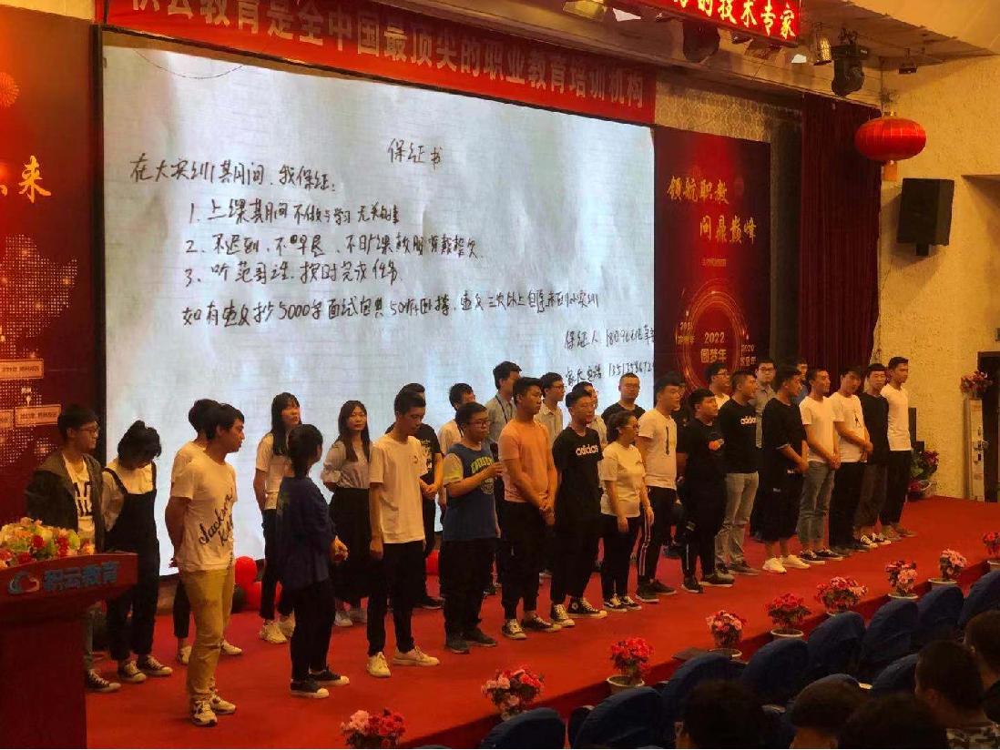
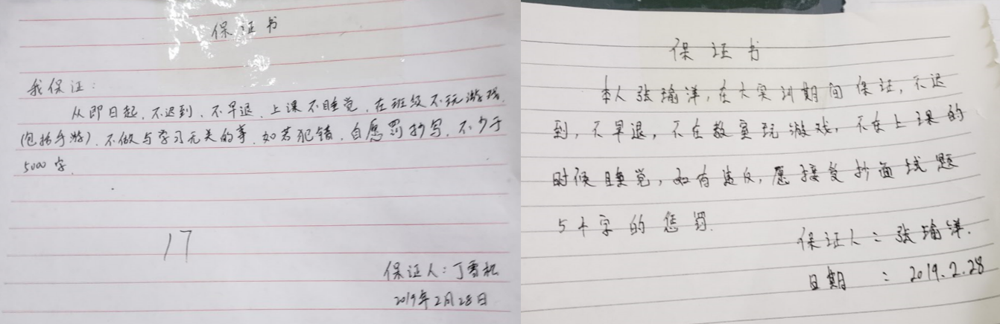
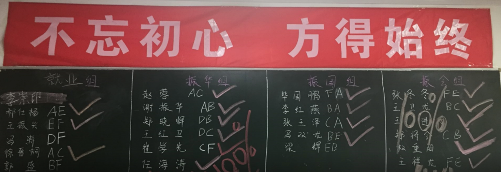

`就业就是拼信心`

## 01.传递信心

### 1.1 项目经理自我介绍

- 工作过的公司和担任过的职务
- 以往带班的真实数据
     - 分析自己带班不好班级问题
     - 分析问题学生（就业慢的同学）
- 自己对教育行业的热爱以及工作方式的表态

### 1.2 优秀就业案例分享

- 家庭条件比较差通过自己努力就业

- 学习态度不好改变态度后就业

### 1.3 对本专业镜像市场利好分析

- 对薪资，岗位从第三方网站的数据进行利好展示
- 可以到boss直聘搜索python工程师
     - 第一：岗位薪资
     - 第二：岗位数量
     - 切记：不要贬低其他

## 02.班委分组

### 2.1 班长选定

- 学生自荐、或向上个阶段学生或原讲师了解
- 负责、正直、积极、正能量，竞争意识强且与讲师关系亲近
- 明确班长所能享受到的特殊帮扶措施
     - 实训期间有问题了，优先解决
     - 工作有问题优先解决
     - 提前灌输，就业后老师不能一直守候着给解决问题

### 2.2 小组确定

- 根据升班成绩选出4~6名组长
- 根据升班成绩将学生划分为ABC三类，不允许一组全部是B或者C类学生
- 公开赋权并全力支持组长工作

### 2.3 小组使用

- `每天例行晨会`，以组为单位对前一天知识进行提问，奖优罚劣
- 小组交叉检查作业，`抽查发现问题之后惩罚检查人而不惩罚被检查人`
- `每周通关考试之后，表扬成绩排名第一的小组`（激发同学荣誉感）
- 接下来一周指定优秀学习小组对最后一名小组成员一对一帮扶

## 03.宣誓

### 3.1 用好保证书

> 每一名学生要在第一天写一份保证书，项目经理需划定惩罚的底线，由学生自主
> 选择具体的惩罚措施，并当众宣读，然后保证书上墙，宣读过程录屏存档
> 例如：我叫张三，我保证实训期间不迟到早退，按时按质按量完成教学任务，
> 如果有做不到罚抄字，或者乐捐红包元，累计超过三次主动末班到小实训

- 学生说话不算数怎么办？（`利用学生间爱面子来控制`）
- 保证书写给他同桌看的，对桌看的
- 让学生自己说惩罚措施
     - 比如引导学生说，如果来晚了操面试题一万字
     - 最好录视频，并保存好，如果犯了，不认真做，每天上课先把录得视频放一边

- 注：保证书条数不要太多

### 3.2 保证书范例

- 案例1

 </img>

- 案例二

 </img>

### 3.3 PK

- 项目经理引导班级小组形成良性竞争，所有分组必须上墙，
- 例如：
     - 第一个百分百就业的小组每人奖励200块钱，
     - 第二名百分百就业的小组每人奖励100块钱，
     - 最后一名百分百就业的小组请全班同学吃饭

 </img>

## 04.控班技巧

### 4.1 日清日结树立权威

- 开课前一周，每天晨会对所有的学生逐个过前一天讲的重难点，
- 不会的学生按照保证书内容严格执行惩罚，一周后权利下放，班长检查组长，组长检查组员，
- 项目经理抽查，发现弄虚作假，惩罚检查人表扬被检查人。

### 4.2 聊天谈心恩威并济

- 在惩罚过程中发现明显节奏较慢，理解能力较弱的学生逐个沟通
- 树立阶段学习目标，表明自己的态度，从内心深处获取学生的信任

### 4.3 学生分享深信不疑

- 每个月找已经就业且跟自己关系不错的学生返校给学生分享，
- 一方面让同龄人产生共鸣，另一方面能借学生的口把自己想说而又不能经常说的话说出来
     - 以前学习也非常困难，最后还是熬过来了，现在薪资 15000
     - 现在生活，买东西的变化等

### 4.4 誓师大会斗志昂扬

- 就业前让每个学生定位自己的薪资，对于薪资项目经理既不拔高也不压低，
- 但是要让侧面去引导，最后让学生自己定好目标，方法，写成文字，对着大家宣誓
     - 例如：我叫张三，我是xx组的，我要在两周内找一份工资1W块钱的工作，
     - `如果两周之内找不到我每天抄一遍B简历发到班级群里，一直找到为止，然后请全组人吃饭。`
          - 这个事情要让同学自己说出来
- 提前对问题学生引导，学习一些技术边缘岗（技术支持、运维）
- 找工作之前要树立学生正确态度（`一定要在找工作前说`）
     - 查学历问题
          - 每年毕业几千人，都没有学历，最后都能找到挺好的工作
          - 去年毕业的xxx同学，现在薪资 xxx 一直非常稳定
     - 被退回问题
          - 给自己立一个小目标，第一次能在公司呆一周，第二次再找一个争取带两周
          - 在你找第一份工作前，公司长啥样，公司有几个人你都不知道，
          - 至少现在你知道公司流程是什么，公司有哪些人，公司门朝哪开

 </img>

 </img>